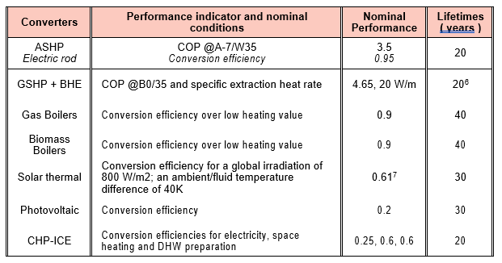

 .. _Drescription of models :

Models
===============

Transformers
-------------

As of now, optihood is available as an open source code and needs to be installed from source. Please follow the
Modelsm models modesl....and should be

1. Generic Combined transformers (GDY)

2. Air Source Heat Pumps (SPA)

3. Ground Source Heat pumps (SPA)

4. Combined heat and power (GDY)

The modeling of the component for Generic Combined transformers is built from a class called "CHP" which is a specificity of the "GenericCHP" class of the oemof.solph library.
The physical model used to model this component is an energy transformation from an incoming stream modeling the energy source of supply to the CHP machine. The outgoing flows of this component consist of both electrical and thermal energy.

Pelec_in = Qsh/efficiencySH + Qdhw/efficiencyDHW          = Pelec_out/efficiencyEl

More equations used in this model are given:

https://link.springer.com/article/10.1007/s40095-016-0204-6

For more information on the component and the associated constraints:

https://oemof-solph.readthedocs.io/en/latest/usage.html#genericchp-component

The "solph.Investment" function is used in the code to represent the investment costs associated with a CHP system are modeled with the oemof.solph package. It is used to calculate the optimal investment costs as part of solving the optimization model. The environmental costs of a CHP are also implemented.

5. Boilers (GDY)

The modeling of the component for boilers is built from a class called "GasBoiler" which is a specificity of the "Transformer" class of the oemof.solph library.
The physical model used to model this component is a linear transformation of the incoming flow, here the gas or biomass, to an outgoing flow. A conversion factor is applied to the output flow according to the boiler efficiency.
For more information on the component and the associated constraints:

https://oemof-solph.readthedocs.io/en/latest/reference/oemof.solph.components.html

The "solph.Investment" function is used in the code to represent the investment costs of the boiler (in CHF/kWh) modeled with the oemof.solph package. It is used to calculate the optimal investment costs in the context of solving the optimization model. The environmental costs of the boiler (CO2equivalent/kWh) are also implemented.

6. Electric Rod (GDY)

The modeling of the component for electric rods is built from a class called "ElectricRod" which is a specificity of the "Transformer" class of the oemof.solph library.

The physical model used is the same as for a boiler with a linear transformation.

Pelec_in = Qsh/efficiencySH + Qdhw/efficiencyDHW

More information :

https://oemof-solph.readthedocs.io/en/latest/reference/oemof.solph.components.html#module-oemof.solph.components._transformer

The financial and environmental costs are also defined with the oemof.soph package.

Solar technologies
-------------
1. Solar thermal (SPA)
--> link to OEMOF
+ differential temperature levels

2. Photovoltaics (SPA)
--> link to OEMOF

Energy Storage
-------------
Optihood uses in its code the modeling of components for energy storage. The modeling of these storage components is done through the oemof-solph library. The GenericStorage function is used to model a storage component with an input argument and an output argument. Two classes have been created, one for electrical storage and the other for thermal storage.

1. Electric Batteries (GDY)

The modeling of the component for electrical storage is built from a class called "ElectricalStorage" which is a specificity of the "GenericStorage" class of the oemof.solph library. The "ElectricalStorage" class uses the "solph.Flow" object to represent the incoming and outgoing energy flows. This class includes a constructor with several arguments: the definition of the inputs and outputs of the system, the energy loss rate, the initial storage level, the conversion efficiency of the incoming and outgoing energy, the minimum and maximum capacity of the storage, the investment costs and the distribution mode in particular.

The physical model considers the state of charge of the storage at each time step based on the input and output of energy from the thermal storage from the storage state at the previous time step.

The various constraints are described:
https://oemofsolph.readthedocs.io/en/latest/reference/oemof.solph.components.html#module-oemof.solph.components._generic_storage

The "solph.Investment" function is used in the code to represent the investment costs associated with an energy system modeled with the oemof.solph package. It is used to calculate the optimal investment costs as part of the optimization model solution. Environmental costs are also implemented.

2. Domestic hot water storage & hot water storage(GDY)

The modeling of the thermal storage component is built from a class called "ThermalStorage" which is a specificity of the "GenericStorage" class of the oemof.solph library. Like the "ElectricalStorage" class, this class uses the "solph.Flow" object. This class includes a constructor with several arguments: the definition of the inputs and outputs of the system, the energy loss rate, the initial storage level, the conversion efficiency of the incoming and outgoing energy, the minimum and maximum capacity of the storage, the investment costs and the distribution mode in particular.

The physical model considers the state of charge of the storage at each time step based on the input and output of energy from the thermal storage from the storage state at the previous time step.

The various constraints are described:
https://oemofsolph.readthedocs.io/en/latest/reference/oemof.solph.components.html#module-oemof.solph.components._generic_storage

The physical model for thermal storage is stratified. The stratification implemented by the oemof library takes into account two perfectly separated water masses that move according to the charge and discharge of the storage induced by the input or output of the storage energy. The storage is assumed to be cylindrical, the temperature within a zone is homogeneous, the material properties constant, a single heat transfer coefficient and a single surrounding temperature. The equation describing the content of the storage at a time step is given by :

.. image:: ./guide/resources/equation_stratified_thermal_strorage.PNG
      :width: 140
      :alt: constraint2
      :align: center

For more information: https://oemof-thermal.readthedocs.io/en/latest/stratified_thermal_storage.html

For the calculation of energy losses, a function called "precalculate" has been defined. This function calculates the thermal losses and the U-value from the functions "calculate_storage_u_value" and "calculate_losses". The heat losses are calculated from stratified thermal storage models.

The "solph.Investment" function is used in the code to represent the investment costs associated with an energy system modeled with the oemof.solph package. It is used to calculate the optimal investment costs in the context of solving the optimization model.

Summary
-------------
image of table with nominal performances report WP1

.. image:: ./guide/resources/Summary_Storage.PNG
      :width: 140
      :alt: constraint2
      :align: center